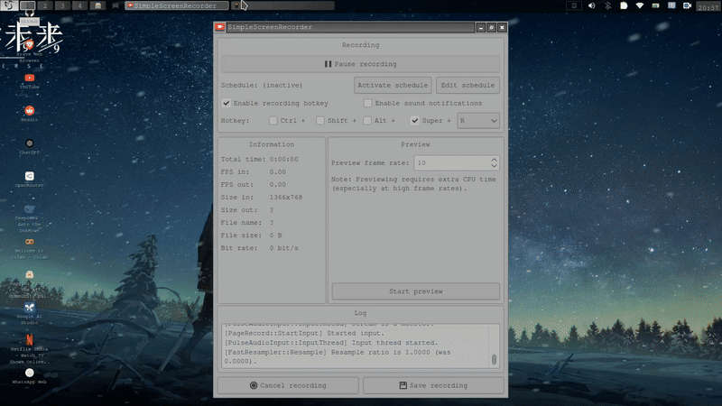

# fcat - `cat` on protein with Fuzzy Finding and Directory Intelligence

**fcat (Fuzzy Cat)** is a powerful command-line utility that enhances your file viewing experience. It combines the directory-jumping intelligence of tools like `zoxide` with the fuzzy-finding capabilities of `fzf` and the beautiful output of `bat` (or `batcat`) to let you quickly find and view files, even if you only know parts of their name or the project they belong to.

Say goodbye to typing long paths and `ls | grep` chains!

## DEMO
[Watch the Full video here](fcat.mp4)



## Motivation

Navigating and viewing files from the terminal can be cumbersome:
*   Remembering and typing full paths to files is tedious (e.g., `cat ~/projects/web/my-awesome-app/src/components/UserProfile.js`).
*   Standard `cat` offers no syntax highlighting or pleasant viewing experience.
*   Finding a specific file when you only know its name (e.g., `index.html`) across many projects can be a pain.

`fcat` aims to solve these problems by providing a `zoxide`-like experience for files: give it some hints about the directory and filename, and it intelligently finds and displays the content.

## Features

*   **Fuzzy Filename Searching:** Find files even with partial name matches.
*   **Intelligent Directory Hinting:**
    *   Provide parts of a directory name or project name as a hint.
    *   Uses direct path matching.
    *   Integrates deeply with **`zoxide`**:
        *   Attempts non-interactive best-guess directory resolution.
        *   Falls back to **`zoxide`'s interactive selection** (`zoxide query -i`) if the hint is ambiguous, letting you choose the target directory from `zoxide`'s history.
*   **Enhanced File Viewing:** Uses `bat` (or `batcat`) for syntax highlighting, line numbers, and Git integration if available. Falls back gracefully to `cat`.
*   **Real-time Searching:** Uses `fd` (if available) or `find` for up-to-the-moment file lists (no stale `locate` databases).
*   **User-Friendly Feedback:** Provides clear messages about its search process and fallbacks.
*   **Portable:** Designed to work on Bash (3.x and 4.x+) and Zsh.
*   **Configurable:** Easy to modify the script for personal preferences (e.g., fallback commands).

## Demo Flow

Imagine you want to view an `index.html` file within a project you vaguely remember as "my web app".

1.  You type: `fcat my web app index.html`
2.  `fcat` processes this:
    *   `dir_hint_string` = "my web app"
    *   `filename_query` = "index.html"
3.  `fcat` attempts to resolve "my web app":
    *   Checks if "./my web app" or "/my web app" is a direct path. (Probably not)
    *   Tries `zoxide query "my web app"` for a quick match.
    *   If no single match, it might launch `zoxide query -i "my web app"`, showing you a list of directories `zoxide` knows that match "my web app". You select the correct one (e.g., `~/projects/my-web-application`).
4.  Once the directory is resolved (e.g., to `~/projects/my-web-application`), `fcat` searches *only within this directory* for files matching "index.html".
5.  `fzf` pops up with a list of matching files from that directory, pre-filtered by "index.html", with live previews via `bat`.
6.  You select the desired `index.html` and its content is displayed beautifully by `bat`.

If the directory hint couldn't be resolved even with interactive `zoxide`, `fcat` would fall back to searching your current directory (`.`) and home directory (`~`) for files matching "my web app index.html".

## Dependencies

*   **`fzf`**: (Required) For fuzzy finding and interactive selection.
*   **`bat`** or **`batcat`**: (Highly Recommended) For enhanced file viewing with syntax highlighting. `fcat` will gracefully fall back to `cat` if not found.
*   **`fd`** (or `fdfind`): (Recommended) A fast alternative to `find`. `fcat` will use `find` if `fd` is not available.
*   **`zoxide`**: (Recommended for best directory hinting) For intelligent directory resolution based on your history. `fcat` works without it, but directory hinting will be less powerful.
*   **`realpath`**: (Usually available) For resolving symbolic links and canonicalizing paths.

**Installation instructions for common package managers:**

*   **Debian/Ubuntu:**
    ```bash
    sudo apt update
    sudo apt install fzf bat fd-find zoxide # 'bat' might be 'batcat', 'fd-find' binary is often 'fdfind'
    ```
*   **Fedora:**
    ```bash
    sudo dnf install fzf bat fd-find zoxide
    ```
*   **Arch Linux:**
    ```bash
    sudo pacman -Syu fzf bat fd zoxide
    ```
*   **macOS (Homebrew):**
    ```bash
    brew install fzf bat fd zoxide
    ```
*   **Windows (Scoop/Chocolatey):**
    *   `scoop install fzf bat fd zoxide`
    *   `choco install fzf bat fd.portable zoxide` (Ensure binaries are in PATH)

## Installation

1.  **Copy the `fcat` script:**
    Copy the entire `fcat` shell function provided (fcat_function.txt)

2.  **Add to your shell configuration file at the bottom end:**
    *   For **Bash**, paste it into your `~/.bashrc` file.
    *   For **Zsh**, paste it into your `~/.zshrc` file. (coming soon)

3.  **Reload your shell configuration:**
    *   For Bash: `source ~/.bashrc`
    *   For Zsh: `source ~/.zshrc` (coming soon)
    (Alternatively, open a new terminal window.)

## Usage

The basic syntax is:

```bash
fcat [directory_hint_part_1 directory_hint_part_2 ...] [filename_query]
```
## ignore file
Fcat can ignore specified files and folders during scanning, which will significantly improve speed.

```bash
Location: fcat will look for an ignore file at ~/.config/fcat/fcat.ignore
```
Example fcat.ignore content:

```bash
node_modules
.cache
build
dist
output
target
*.log
temp/
```
